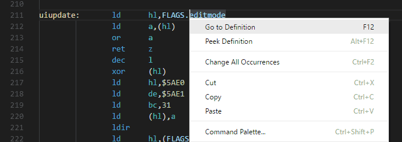
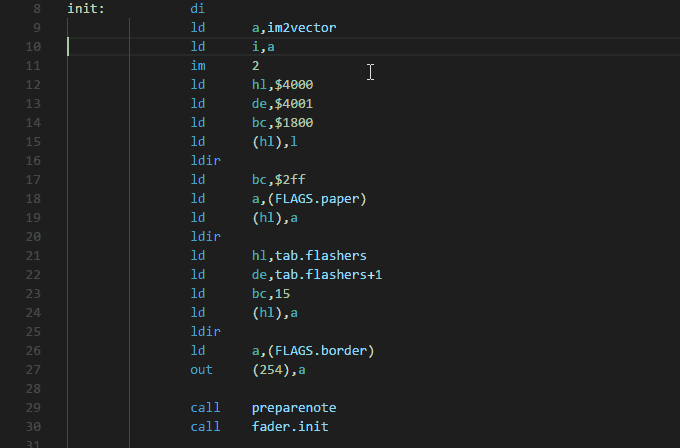
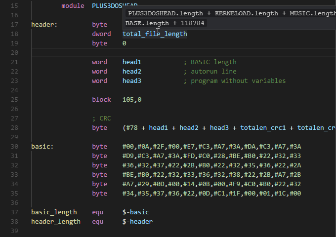
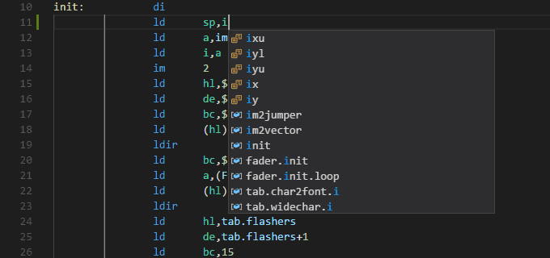
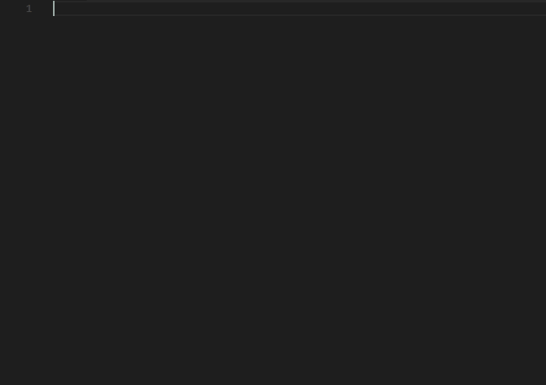
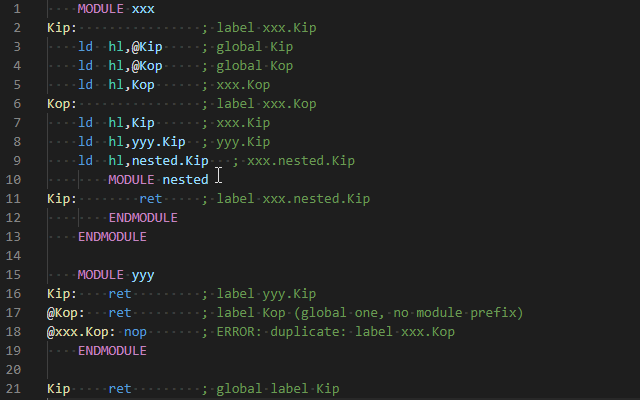

# Support for Z80 macro-assemblers in Visual Studio Code

The **Z80 Macro-Assembler** extension for Visual Studio Code provides the following features inside VS Code:

* syntax highlighting for Z80 assembly sources of well known Z80 macro-assemblers, for example:
  - [SjASM](http://www.xl2s.tk/) or [SjASMPlus](https://github.com/z00m128/sjasmplus)
  - [Macroassembler AS](http://john.ccac.rwth-aachen.de:8000/as/)
  - [Pasmo](http://pasmo.speccy.org/)
  - [rasm](http://www.roudoudou.com/rasm/)
  - [tniASM](http://www.tni.nl/products/tniasm.html) (v0.x series)
* [problem matchers](#problem-matchers) for **SjASMPlus**, **Macroassembler AS**, **rasm** and **tniASM** compilation output
* label or symbol [defintion documentation](#definitions), suggestions on hover or typing
* macro documentation and argument definition suggestions
* semi-automatic [completition](#completion) with formatting
* [renaming](#renaming) of labels or symbols
* [formatting](#formatter) of block or whole document
* snippets for macros and source control keywords

## ⚙️ Settings

These few options allows you to configure extension's behavior but primarily your code-formatting preferences and code completion:

- `z80-macroasm.files.exclude` - Choose files or directories to exclude _(e.g `'**/*.{lst}'`)_.
- `z80-macroasm.files.include` - Files to include and work with. If you, or your macro-assembler using a different conventions of source file extensions then change it here.
  > default: `"**/*.{a80,asm,inc,s}"`
- `z80-macroasm.seekSymbolsThroughWorkspace` - If true, extension will crawl through all your workspace files to document all symbols. Otherwise, only includes are taken into account.
  > default: `false`

### Formatter:
- `z80-macroasm.format.baseIndent` - How many tabstops you prefer before the instructions or keywords.
  > default: `2`
- `z80-macroasm.format.controlIndent` - How many tabstops you prefer before the control structure keywords, selections, modules, or blocks.
  > default: `1`
- `z80-macroasm.format.whitespaceAfterInstruction` - Which type of whitespace you want to put after the instruction - `"tab"`, `"single-space"` or `"auto"` which autodetect file's tabstop type and width.
  > default: `"auto"`
- `z80-macroasm.format.spaceAfterArgument` - If you want to put a single space character after comma (instruction's argument).
  > default: `false`
- `z80-macroasm.format.uppercaseKeywords` - If true, uppercase all keywords, instructions and registers. False means all lowercased and `"auto"` tries to auto-detect your code-style while typing.
  > default: `"auto"`
- `z80-macroasm.format.bracketType` - Define which type of brackets around the instruction's arguments (pointers) you prefer: `(round)` or `[square]`.
  > default: `"round"`
- `z80-macroasm.format.colonAfterLabels` - Put colon after each label or symbol (true or false, `"no-change"` keeps it untouched).
  > default: `"no-change"`
- `z80-macroasm.format.splitInstructionsByColon` - Split colon separated instructions to lines.
  > default: `true`

These keys/values can be used in your workspace or global `settings.json`.
[See example &raquo;&raquo;](https://github.com/mborik/z80-macroasm-vscode/wiki/Home/settings.json)

## 🚨 Problem matchers

There are some predefined problem matchers to handle reported errors from compilation output:
- `errmatcher-as` for **Macroassembler AS**
- `errmatcher-sjasmplus` for **SjASMPlus**
- `errmatcher-sjasm` for **SjASM**
- `errmatcher-rasm` for **rasm**
- `errmatcher-tniasm` and `errmatcher-tniasm-preprocessor` for **tniASM**

These values can be used in `.vscode/tasks.json` of your project's build task.
[See example &raquo;&raquo;](https://github.com/mborik/z80-macroasm-vscode/wiki/Home/tasks.json)

## 💡 IntelliSense showcase

### Symbol suggestions:
- provide symbols or labels
  - in current file in "Go to Symbol in File..." [`Ctrl+Shift+O`, `Cmd+Shift+O`]
  - in all includes in "Go to Symbol in Workspace..." [`Ctrl+T`, `Cmd+T`]
  - in Outline side-bar

### Definitions:
> 

- Generated map of every symbol defined considers also modules or temporal labels:
> 

- Show symbol's value or specific definiton on hover:
> 

### Completion:
> 

- Inteligent completion of directives, pseudo-instructions, Z80 instructions, registers, labels or symbols:
> 

### Renaming:
- Allow to rename labels, local labels, module names or macro indetifiers in InteliSense meaning.
> 

## ⌨️ Credits

This extension was done by **Martin Bórik** with some inspirations from these VS Code extensions:
- [`z80asm-vscode`](https://github.com/Imanolea/z80asm-vscode) by **Imanol Barriuso**
- [`vscode-pasmo`](https://github.com/BouKiCHi/vscode-pasmo) by **BouKiCHi**
- [`rgbds-vscode`](https://github.com/DonaldHays/rgbds-vscode) by **Donald Hays**

## 📋 License

The Z80 Assembly extension is subject to [these license terms](LICENSE).

The source code to this extension is available on [github](https://github.com/mborik/z80-macroasm-vscode) and licensed under the [MIT license](LICENSE).
